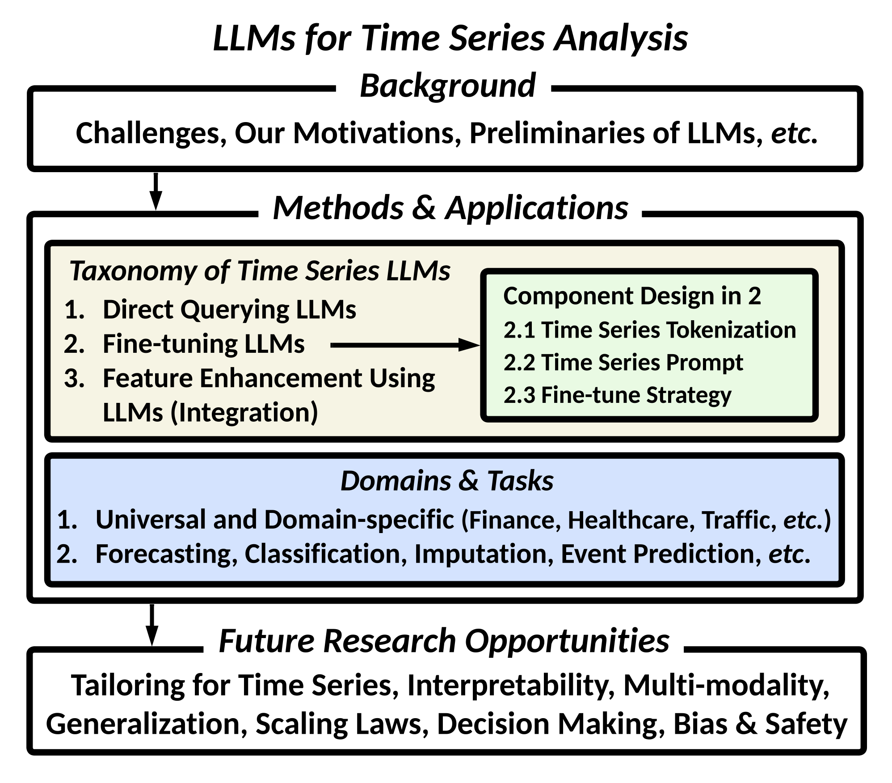
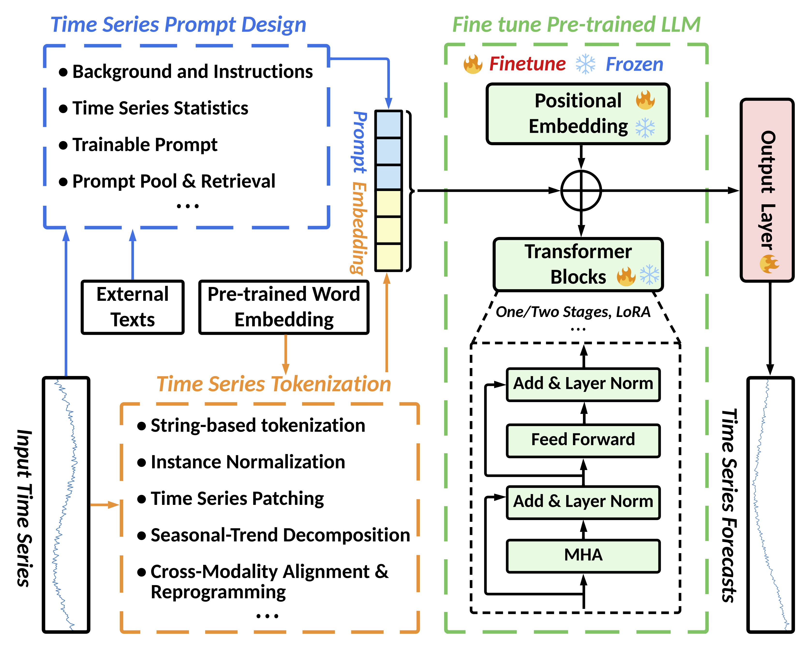

# Empowering-Time-Series-Analysis-with-LLMs
This is the official repository for "Empowering Time Series Analysis with Large Language Models: A Survey" <br>

This repository is activately maintained by [*Yushan Jiang*](https://sites.google.com/view/jayjiang/home) and [*Zijie Pan*](https://www.linkedin.com/in/zijiepan?challengeId=AQFIFj5C6TIkHAAAAYorMg7B2AeyTHiG6ydTY1x-UI5EGjLsdaZJ0Y0RBaUR2kYx6EBKy_P1l7xa7V_p3eK8ZimyqeIGOvx9BQ&submissionId=0dfe8771-9c89-7e17-1726-261b141fe852&challengeSource=AgGvUfroPpp0hQAAAYorMnRhqu49XriAlKHKecuhg1I-dD3E2L5TzP28ELScYzs&challegeType=AgF5kNYwhmhZKwAAAYorMnRkOD1dOFOY2SyQbE2noHz3ZcyHhGrPSL4&memberId=AgHccQ5LAWwXMgAAAYorMnRmgTbPDp6EVevD51vyoVhsjag&recognizeDevice=AgGWhR25_UZSqAAAAYorMnRphBUCqBMivCqoLXw_jveZM8Iu5Rn_) from ***UConn DSIS*** Group led by [*Dr. Dongjin Song*](https://songdj.github.io/#about). As this research topic has recently gained significant popularity, with new articles emerging daily, we will update our repository and survey regularly.

If you find some ignored papers, **feel free to *create pull requests*, *open issues*, or *email* [*Yushan*](mailto:yushan.jiang@uconn.com) & [*Zijie*](mailto:zijie.pan@uconn.com)**. <br/> 

Please consider [citing](#citation) our survey paper if you find it helpful :), and feel free to share this repository with others! 

### Motivation and Contribution:

The rapid development of LLMs in natural language processing has unveiled unprecedented capabilities in sequential modeling and pattern recognition. It is natural to ask: ***How can LLMs be effectively leveraged to advance general-purpose time series analysis?*** 

Our survey aims to answer the question based on a thorough overview of existing literature, as shown in Figure 1. We claim that LLMs can serve as a flexible as well as highly competent component in the time series modeling: 

1) The flexibility lies in a wide spectrum of available ***LLMs that can be employed and the variety of ways they can be configured for time series analysis***, where we categorize the existing methods into five groups based on the methodology.
2) Regarding their competence, ***LLMs can be tailored for a wide range of real-world applications with domain-specific context*** , where we discuss their application tasks and domains.
3) We discuss and highlight future directions that advance time series analysis with LLMs.

<br/>

|[](image.png) |[](image1.png)|
|:--:|:--:| 
| *Figure 1: The Framework of Our Survey* | *Figure 2: Categorization of Component Design for Fine-tuning Time Series LLMs* |

<br/>

## Taxonomy of Time Series LLMs

### Taxonomy via Methodology
To adopt LLMs for time series analysis, three primary methods are employed: ***direct querying of LLMs***, ***fine-tuning LLMs with tailored designs***, and ***incorporating LLMs into time series models as a means of feature enhancement (integration)***. Specifically, three key components can be leveraged to fine-tune LLMs, as shown in Figure 2: The input time series are first tokenized into embedding based on proper tokenization techniques, where proper prompts can be adopted to further enhance the time series representation. As such, LLMs can better comprehend prompt-enhanced time series embedding and be fine-tuned for downstream tasks, based on sophisticated strategies.

### Taxonomy via Task and Domain
* **Forecasting**
    - (General) Time-LLM: Time Series Forecasting by Reprogramming Large Language Models [paper](https://arxiv.org/abs/2310.01728), [code](https://github.com/kimmeen/time-llm)
    - (General) TEMPO: Prompt-based Generative Pre-trained Transformer for Time Series Forecasting [paper](https://arxiv.org/abs/2310.04948)
    - (General) LLM4TS: Aligning Pre-Trained LLMs as Data-Efficient Time-Series Forecasters [paper](https://arxiv.org/abs/2308.08469)
    - (General) PromptCast: A New Prompt-based Learning Paradigm for Time Series Forecasting [paper](https://arxiv.org/abs/2210.08964), [code](https://github.com/HaoUNSW/PISA)
    - (General) Large Language Models Are Zero-Shot Time Series Forecasters [paper](https://arxiv.org/abs/2310.07820), [code](https://github.com/ngruver/llmtime)
    - (Finance) Temporal Data Meets LLM -- Explainable Financial Time Series Forecasting [paper](https://arxiv.org/abs/2306.11025), [dataset](https://github.com/ZihanChen1995/ChatGPT-GNN-StockPredict)
    - (Mobility) Leveraging Language Foundation Models for Human Mobility Forecasting [paper](https://arxiv.org/abs/2209.05479), [code](https://github.com/cruiseresearchgroup/AuxMobLCast)
    - (Mobility) Where Would I Go Next? Large Language Models as Human Mobility Predictors [paper](https://arxiv.org/abs/2308.15197), [code](https://github.com/xlwang233/LLM-Mob)
    - (Traffic) Spatial-Temporal Large Language Model for Traffic Prediction [paper](https://arxiv.org/abs/2401.10134)
 


* **Classification**
    - (Finance) The Wall Street Neophyte: A Zero-Shot Analysis of ChatGPT Over MultiModal Stock Movement Prediction Challenges
    - (Finance) ChatGPT Informed Graph Neural Network for Stock Movement Prediction [paper](https://arxiv.org/abs/2306.03763)
    - (Healthcare) Frozen Language Model Helps ECG Zero-Shot Learning [paper](https://arxiv.org/abs/2303.12311)
    - (Healthcare) Health system-scale language models are all-purpose prediction engines [paper](https://www.nature.com/articles/s41586-023-06160-y), [code](https://github.com/nyuolab/NYUTron)
    - (Vision) Language Knowledge-Assisted Representation Learning for Skeleton-Based Action Recognition [paper](https://arxiv.org/abs/2305.12398), [code](https://github.com/damNull/LAGCN)
 
* **Imputation**
    - (Traffic) GATGPT: A Pre-trained Large Language Model with Graph Attention Network for Spatiotemporal Imputation [paper](https://arxiv.org/abs/2311.14332)
      
* **Event Prediction**
    - (General) Language Models Can Improve Event Prediction by Few-Shot Abductive Reasoning [paper](https://arxiv.org/abs/2305.16646) [code](https://github.com/iLampard/lamp)
    - (General) Drafting Event Schemas using Language Models [papers](https://arxiv.org/abs/2305.14847)
  
* **Multiple Tasks**
    - ***Forecasting & Classification & Imputation & Anomaly Detection*** (General) One Fits All:Power General Time Series Analysis by Pretrained LM [paper](https://arxiv.org/abs/2302.11939) [code](https://github.com/DAMO-DI-ML/NeurIPS2023-One-Fits-All)
    - ***Forecasting & Classification*** (General) TEST: Text Prototype Aligned Embedding to Activate LLM's Ability for Time Series [paper](https://arxiv.org/abs/2308.08241) [code](https://openreview.net/attachment?id=Tuh4nZVb0g&name=supplementary_material)
    - ***Forecasting & Classification*** (Healthcare) Large Language Models are Few-Shot Health Learners [paper](https://arxiv.org/abs/2305.15525)


#### Table 1: Taxonomy of Time Series LLMs - Methdology, Task and Domain
<sub>The data type **TS** denotes general time series, **ST** denotes spatial-temporal time series, the prefix **M-** indicates multi-modal inputs. ***Q*** denotes direct query the whole LLMs for output, ***T*** denotes the design of time series tokenization, ***P*** indicates the design of textual or parameterized time series prompts, ***FT*** indicates if the parameters of LLMs are updated (fine-tuned), ***I*** indicates if LLMs are integrated as part of the final model for downstream tasks. *Code availability is assessed on January 31st, 2024.* </sub> 
| <sub>**Method**</sub> | <sub> Data </sub> | <sub>Domain</sub> | <sub>Task</sub> | <sub>*Q*</sub> | <sub>*T*</sub> | <sub>*P*</sub> | <sub>*FT*</sub> | <sub>*I*</sub> | <sub>LLM</sub> | <sub>Code</sub> |
|:--------:|:-----:|:--------:|:------:|:-------:|:-------:|:--------:|:-----------:|:---------:|:-----:|:---:|
| <sub>[Time-LLM](https://arxiv.org/abs/2310.01728)<br/>(ICLR 2024)</sub> | <sub>M-TS</sub> | <sub>General</sub> | <sub>Forecasting</sub> | ✘ | ✔ | ✔ | ✔ | ✘ | <sub>LLaMA, GPT-2</sub> | [✔](https://github.com/kimmeen/time-llm)|
| <sub>[OFA](https://arxiv.org/abs/2302.11939)<br/>(NeurIPS 2023)</sub> | <sub>TS</sub> | <sub>General</sub> | <sub>Forecasting,<br/>Classification,<br/>Imputation,<br/>Anomaly Detection</sub> | ✘ | ✔ | ✘ | ✔ | ✘ | <sub>GPT-2</sub> | [✔](https://github.com/DAMO-DI-ML/NeurIPS2023-One-Fits-All) |
| <sub>[TEMPO](https://arxiv.org/abs/2310.04948)<br/>(ICLR2024)</sub> | <sub>TS</sub> | <sub>General</sub> | <sub>Forecasting</sub> | ✘ | ✔ | ✔ | ✔ | ✘ | <sub>GPT-2</sub> | <sub>✘</sub> |
| <sub>[TEST](https://openreview.net/forum?id=Tuh4nZVb0g)<br/>(ICLR2024)</sub> | <sub>M-TS</sub> | <sub>General</sub> | <sub>Forecasting, Classification</sub> | ✘ | ✔ | ✔ | ✘ | ✔ | <sub>BERT, GPT-2,<br/> ChatGLM, LLaMA2</sub> | [✔](https://openreview.net/forum?id=Tuh4nZVb0g) |
| <sub>[LLM4TS, 2023](https://arxiv.org/abs/2308.08469)<br/></sub> | <sub>TS</sub> | <sub>General</sub> | <sub>Forecasting</sub> | ✘ | ✔ | ✘ | ✔ | ✘ | <sub>GPT-2</sub> | <sub>✘</sub> |
| <sub>[PromptCast](https://arxiv.org/abs/2210.08964)<br/>(IEEE TKDE 2023)</sub> | <sub>TS</sub> | <sub>General</sub> | <sub>Forecasting</sub> | ✔ | ✘ | ✔ | ✘ | ✘ | <sub>Bart, BERT, etc.</sub> | [✔](https://github.com/HaoUNSW/PISA) |
| <sub>[LLMTIME](https://arxiv.org/abs/2310.07820)<br/>(NeurIPS 2023)</sub> | <sub>TS</sub> | <sub>General</sub> | <sub>Forecasting</sub> | ✔ | ✔ | ✘ | ✘ | ✘ | <sub>GPT-3, LLaMA-2</sub> | [✔](https://github.com/ngruver/llmtime)</sub> |
| <sub>[LAMP](https://arxiv.org/abs/2308.08241)<br/>(NeurIPS 2023)</sub> | <sub>TS</sub> | <sub>General</sub> | <sub>Event Prediction</sub> | ✔ | ✘ | ✔ | ✘ | ✔ | <sub>GPT-3 & 3.5,<br/> LLaMA-2</sub> | [✔](https://github.com/iLampard/lamp) |
| <sub>[Gunjal *et al.*, 2023](https://arxiv.org/abs/2305.14847)</sub> | <sub>TS</sub> | <sub>General</sub> | <sub>Event Prediction</sub> | ✔ | ✘ | ✔ | ✘ | ✘ | <sub>GPT-3.5, Flan-T5, etc.</sub> | <sub>✘</sub> |
| <sub>[Yu *et al.*, 2023](https://arxiv.org/abs/2306.11025)</sub>| <sub>M-TS</sub> | <sub>Finance</sub> | <sub>Forecasting</sub> | ✔ | ✘ | ✔ | ✔ | ✘ | <sub>GPT-4, Open-LLaMA</sub> | <sub>✘</sub> |  
| <sub>[Lopez-Lira *et al.*, 2023](https://arxiv.org/abs/2304.07619)</sub> | <sub>M-TS</sub> | <sub>Finance</sub> | <sub>Forecasting</sub> | ✔ | ✘ | ✔ | ✘ | ✔ | <sub>ChatGPT</sub> | <sub>✘</sub> |
| <sub>[Xie *et al.*, 2023](https://arxiv.org/abs/2304.05351)</sub> | <sub>M-TS</sub> | <sub>Finance</sub> | <sub>Classification</sub> | ✔ | ✘ | ✔ | ✘ | ✘ | <sub>ChatGPT</sub> | <sub>✘</sub> |
| <sub>[Chen *et al.*, 2023](https://arxiv.org/abs/2306.03763)</br>(RobustFin@KDD2023)</sub> | <sub>M-TS</sub> | <sub>Finance</sub> | <sub>Classification</sub> | ✘ | ✘ | ✔ | ✘ | ✔ | <sub>ChatGPT</sub> | [-](https://github.com/ZihanChen1995/ChatGPT-GNN-StockPredict) |
| <sub>[METS, 2023](https://arxiv.org/abs/2303.12311)</br></sub> | <sub>M-TS</sub> | <sub>Healthcare</sub> | <sub>Classification</sub> | ✔ | ✘ | ✔ | ✘ | ✔ | <sub>ClinicalBERT</sub> | <sub>✘</sub> |
| <sub>[Jiang *et al.*,2023](https://www.nature.com/articles/s41586-023-06160-y)<br/>(Nature Comput. Sci.)</sub> | <sub>M-TS</sub> | <sub>Healthcare</sub> | <sub>Classification</sub> | ✘ | ✘ | ✘ | ✔ | ✘ | <sub>NYUTron(BERT)</sub> | [✔](https://github.com/nyuolab/NYUTron) |
| <sub>[Liu *et al.*, 2023](https://arxiv.org/abs/2305.15525)</sub> | <sub>M-TS</sub> | <sub>Healthcare</sub> | <sub>Forecasting, Classification</sub> | ✔ | ✘ | ✔ | ✔ | ✘ | <sub>PaLM</sub> | <sub>✘</sub> |
| <sub>[AuxMobLCast](https://arxiv.org/abs/2209.05479)<br/>(SIGSPATIAL 2022)</sub> | <sub>ST</sub> | <sub>Mobility</sub> | <sub>Forecasting</sub> | ✘ | ✘ | ✔ | ✔ | ✔ | <sub>BERT, RoBERTa,<br/> GPT-2, XLNet</sub> | [✔](https://github.com/cruiseresearchgroup/AuxMobLCast) |
| <sub>[LLM-Mob, 2023](https://arxiv.org/abs/2308.15197)</sub> | <sub>ST</sub> | <sub>Mobility</sub> | <sub>Forecasting</sub> | ✔ | ✘ | ✔ | ✘ | ✘ | <sub>GPT-3.5</sub> | [✔](https://github.com/xlwang233/LLM-Mob) |
| <sub>[ST-LLM, 2024](https://arxiv.org/abs/2401.10134)</sub> | <sub>ST</sub> | <sub>Traffic</sub> | <sub>Forecasting</sub> | ✘ | ✔ | ✘ | ✔ | ✘ | <sub>LLaMA, GPT-2</sub> | <sub>✘</sub> |
| <sub>[GATGPT, 2023](https://arxiv.org/abs/2311.14332) | <sub>ST</sub> | <sub>Traffic</sub> | <sub>Imputation</sub> | ✘ | ✔ | ✘ | ✔ | ✘ | <sub>GPT-2</sub> | <sub>✘</sub> |
| <sub>[LA-GCN, 2023](https://arxiv.org/abs/2305.12398)</sub> | <sub>M-ST</sub> | <sub>Vision</sub> | <sub>Classification</sub> | ✘ | ✔ | ✘ | ✘ | ✔ | <sub>BERT</sub> | [✔](https://github.com/damNull/LAGCN) |

## To be updated:
- MobilityGPT: Enhanced Human Mobility Modeling with a GPT model [paper](https://arxiv.org/abs/2402.03264)
- Exploring Large Language Models for Human Mobility Prediction under Public Events [paper](https://arxiv.org/abs/2311.17351)
- Position Paper: What Can Large Language Models Tell Us about Time Series Analysis [paper](https://arxiv.org/abs/2402.02713)
- UniTime: A Language-Empowered Unified Model for Cross-Domain Time Series Forecasting [paper](https://arxiv.org/pdf/2310.09751.pdf)


## Citation
```
@misc{jiang2024empowering,
      title={Empowering Time Series Analysis with Large Language Models: A Survey}, 
      author={Yushan Jiang and Zijie Pan and Xikun Zhang and Sahil Garg and Anderson Schneider and Yuriy Nevmyvaka and Dongjin Song},
      year={2024},
      eprint={2402.03182},
      archivePrefix={arXiv},
      primaryClass={cs.LG}
}
```

